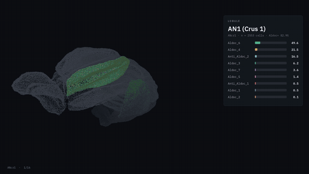

# pc-zebrin-sorting

Analysis of mouse cerebellum snRNA-seq data, looking for a **nuclear** marker
that can separate Purkinje cells into Aldoc-positive and Aldoc-negative
populations on a flow sorter.

**Main result:** `Ebf2` discriminates the two groups (AUC 0.932), is a
DNA-binding transcription factor — so it survives nuclei isolation in 1% Triton
without fixation — and is practically absent from every other cerebellar cell
type.

Full write-up in [`raport/main.pdf`](raport/main.pdf) (in Polish).

---

## The Purkinje layer in 3D



**what you see:**
The Purkinje cell layer of the mouse cerebellum in 3D, rotating 180°. Each lobule
lights up in turn, colored by the Purkinje subtypes it contains. The panel lists
that lobule's composition.

**geometry:** 2,279,886 voxels at 10 µm, computed as the boundary between
granular and molecular layers.

**phenotypes:** 16,634 Purkinje cells, 9 subtypes, 16 lobules.

**made with:** python (numpy, pillow) + ffmpeg.

**data I used:**

Kozareva V, Martin C, Osorno T, et al. A transcriptomic atlas of mouse cerebellar
cortex comprehensively defines cell types. *Nature* 2021;598:214–219.
[doi:10.1038/s41586-021-03220-z](https://doi.org/10.1038/s41586-021-03220-z) ·
GEO: [GSE165371](https://www.ncbi.nlm.nih.gov/geo/query/acc.cgi?acc=GSE165371)

Piluso S, Verasztó C, Carey H, et al. An extended and improved CCFv3 annotation
and Nissl atlas of the entire mouse brain. *Imaging Neuroscience* 2025;
3:imag_a_00565. [doi:10.1162/imag_a_00565](https://doi.org/10.1162/imag_a_00565)
Zenodo: [10.5281/zenodo.15176439](https://doi.org/10.5281/zenodo.15176439) · CC BY 4.0

Built on the Allen Mouse Brain Common Coordinate Framework (CCFv3).

---

full 40 s video: [`figures/film_mozdzek_web.mp4`](figures/film_mozdzek_web.mp4) ·
interactive model: [`figures/purkinje3d_v1.html`](figures/purkinje3d_v1.html) ·
script: [`scripts/58_film_mozdzek.py`](scripts/58_film_mozdzek.py)

---

## Input data

| what | source |
|---|---|
| Mouse cerebellum atlas, 611,034 nuclei | [GEO GSE165371](https://www.ncbi.nlm.nih.gov/geo/query/acc.cgi?acc=GSE165371) (Kozareva et al., *Nature* 2021) |
| Metadata with subtype assignments | [MacoskoLab/cerebellum-atlas-analysis](https://github.com/MacoskoLab/cerebellum-atlas-analysis) |
| Protein localisation annotation | [UniProt](https://rest.uniprot.org), Swiss-Prot mouse, 17,283 records |
| Protein structure models | [AlphaFold DB](https://alphafold.ebi.ac.uk) |

The raw GEO data (3.1 GB) and the `.h5ad` files (825 MB) are not in this
repository. Scripts `00` through `02` rebuild them in about two minutes.

## How to reproduce

```bash
# 1. Download three files from GEO into raw/
#    cb_adult_mouse.mtx.gz, cb_adult_mouse_barcodes.txt, cb_adult_mouse_genes.txt

# 2. Clone the atlas authors' repository (metadata)
git clone https://github.com/MacoskoLab/cerebellum-atlas-analysis.git

# 3. Build the Purkinje subset
python scripts/00_prep_map.py      # barcode mapping, 12 renamed samples
./scripts/01_extract.sh            # streaming column extraction from .mtx.gz
python scripts/02_build_h5ad.py    # assembly + per-cell validation

# 4. Main results
python scripts/33_tabela_genow_lokalizacja.py   # 24,409 genes + UniProt localisation
python scripts/44_audyt_ebf2.py                 # verification of the EBF2 claim
python scripts/43_symulacja_bramki_ebf2.py      # flow-cytometry gate simulation
```

Environment: Python 3.12, scanpy 1.12, anndata 0.13, numpy 2.5, scipy 1.18,
scikit-learn 1.9. PyMOL is only needed for the structural figures.

## Layout

```
scripts/     analysis pipeline, numbered in run order
raport/      LaTeX document (sleek template) + PDF
figures/     figures and renders
references/struktury/   AlphaFold models used in the structural analysis
processed/   result tables (CSV, JSON)
```

## Key scripts

| script | what it does |
|---|---|
| `00_prep_map.py` | joins GEO barcodes to metadata; works around the 12-renamed-samples trap that silently drops 7% of Purkinje cells |
| `01_extract.sh` | streams the Purkinje columns out of a 1.03-billion-entry matrix |
| `02_build_h5ad.py` | assembles `purkinje_cells_v2.h5ad` (16,634 × 24,409) and validates it per cell |
| `33_tabela_genow_lokalizacja.py` | profile of all 24,409 genes across 9 subtypes + subcellular localisation from UniProt |
| `34_topologia_otoczki.py` | determines which side of the nuclear envelope the epitope faces |
| `35`, `37`, `36`, `38` | extraction of selected genes from the full 611,034-nucleus atlas and their profile across 18 cell types |
| `39_ebf2_struktura_fig.py` | pLDDT and EBF2-vs-EBF1 similarity along the sequence |
| `43_symulacja_bramki_ebf2.py` | simulated scatter plot for gate R3 |
| `44_audyt_ebf2.py` | four independent attempts to falsify the EBF2 claim |
| `45_fig_epitop_czarne.pml` | structural figure for the report |
| `49_abc_ebf2.py` | Ebf2 across 16,626 Purkinje cells from ABC Atlas MERFISH, in CCFv3 coordinates |
| `50_abc_ebf2_pasy.py` | tests whether Ebf2-high cells form parasagittal stripes — with a positive control |
| `51_fig_abc_ebf2.py` | four-panel figure summarising the spatial result |
| `58_film_mozdzek.py` | the 3D render above |

## Is Ebf2 a stripe marker?

No — and the test says so with a positive control in place.

Across 16 lobules, the fraction of Ebf2-positive cells falls as the Aldoc+
fraction rises (Pearson −0.518, p = 0.040), so `Ebf2` tracks the **lobular**
gradient, ranging from 26% to 84%. But it does not resolve zebrin stripes:
section-to-section continuity gives 52.6% agreement against 51.2% for permuted
labels, while synthetic 300 µm stripes imposed on the same cells are picked up
at 82.9%. `Ebf1` and `Ebf3`, used as negative controls, show no structure.

Figure: [`figures/abc_ebf2.png`](figures/abc_ebf2.png).

## A note on labels

The Aldoc-positive / Aldoc-negative split comes from the subtype names assigned
by the atlas authors, not from a threshold set in this analysis. Section 2.5 of
the report discusses the limitations of that approach.
